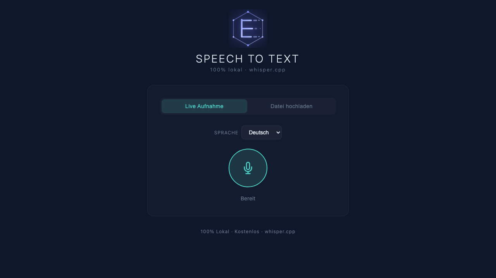

<div align="center">

<!-- Dark/Light mode banner -->
<picture>
  <source media="(prefers-color-scheme: dark)" srcset=".github/assets/banner-dark.svg">
  <source media="(prefers-color-scheme: light)" srcset=".github/assets/banner-light.svg">
  
</picture>

<br />

<!-- Badges -->
[](LICENSE)
[](https://python.org)
[](https://github.com/ggerganov/whisper.cpp)

**Local Speech-to-Text powered by whisper.cpp**

[Quick Start](#quick-start) | [Features](#features) | [API](#api-reference) | [Contributing](CONTRIBUTING.md)

</div>

---

## What is eluma-sst?

A fully local, privacy-first speech-to-text application with an Eluma-branded web interface. Transcribe audio from your microphone or uploaded files without sending a single byte to the cloud. Powered by whisper.cpp for fast, offline inference on your Mac.

## Features

- **Live Microphone Recording** — One-click recording with real-time status and pulse animation
- **File Upload** — Drag & drop or browse for audio files (.ogg, .wav, .mp3, .mp4, .m4a, .webm)
- **5 Languages** — German, English, French, Spanish, Italian with automatic model selection
- **100% Local** — No API keys, no cloud, no data leaves your machine
- **Eluma Dark Theme** — Glassmorphism design with cyan accents and smooth animations
- **Copy to Clipboard** — One-click copy with toast notification
- **Single Command Start** — `./start.sh` launches server and opens browser

## Screenshots

<div align="center">
<picture>
  <source media="(prefers-color-scheme: dark)" srcset=".github/assets/screenshot-2.png">
  <source media="(prefers-color-scheme: light)" srcset=".github/assets/screenshot-1.png">
  
</picture>

<sub>Eluma-branded dark theme with glassmorphism design</sub>
</div>

## Quick Start

```bash
# 1. Clone the repo
git clone https://github.com/alphinus/eluma-sst.git
cd eluma-sst

# 2. Install dependencies
pip install flask flask-cors
brew install ffmpeg  # for audio conversion

# 3. Install whisper.cpp (if not already)
git clone https://github.com/ggerganov/whisper.cpp.git ~/whisper.cpp
cd ~/whisper.cpp && make && bash models/download-ggml-model.sh medium

# 4. Start the app
cd eluma-sst
./browser-app/start.sh
```

The browser opens automatically at `http://localhost:5001`.

### Prerequisites

| Dependency | Purpose |
|-----------|---------|
| Python 3.8+ | Flask server |
| [whisper.cpp](https://github.com/ggerganov/whisper.cpp) | Transcription engine |
| ffmpeg | Audio format conversion |
| Flask + flask-cors | Web server |

## Tech Stack

| Layer | Technology |
|-------|-----------|
| Backend | Python / Flask |
| Frontend | Vanilla HTML/CSS/JS (embedded in server) |
| STT Engine | whisper.cpp (C/C++) |
| Audio Processing | ffmpeg |
| Design | Eluma Brand System |

## Architecture

```
browser-app/
  server.py      # Flask server + embedded HTML frontend
  start.sh       # One-command launcher
  app.html       # Legacy standalone frontend (backup)

tools/           # CLI transcription utilities
docs/            # Setup guides & test protocols
```

**How it works:**
1. Flask serves the HTML frontend at `GET /`
2. Browser records audio via MediaRecorder API or accepts file uploads
3. Audio is sent as FormData to `POST /transcribe`
4. Server converts to 16kHz WAV via ffmpeg, runs whisper.cpp
5. Transcription text is returned as JSON

## API Reference

| Endpoint | Method | Description |
|----------|--------|-------------|
| `/` | GET | Serves the web frontend |
| `/transcribe` | POST | Transcribe audio (FormData: `audio` file + `language` string) |
| `/health` | GET | Health check (`{"status": "ok"}`) |

**Supported languages:** `de`, `en`, `fr`, `es`, `it`

**Model selection:**
- English (`en`) → `ggml-small.en.bin`
- All others → `ggml-medium.bin`
- Fallback chain: medium → small → base

## Documentation

- [Setup Guide](docs/SETUP.md) — Detailed installation instructions
- [User Guide](docs/ANLEITUNG.md) — How to use the app (German)
- [Test Protocol](docs/TEST-PROTOKOLL.md) — Testing documentation

## Contributing

We welcome contributions! See [CONTRIBUTING.md](CONTRIBUTING.md) for guidelines.

```bash
# Clone the repo
git clone https://github.com/alphinus/eluma-sst.git

# Install dependencies
cd eluma-sst && pip install flask flask-cors

# Start development
python3 browser-app/server.py
```

## License

MIT - see [LICENSE](LICENSE) for details.

---

<div align="center">

**Built by [alphinus](https://github.com/alphinus) | [Eluma Developments](https://eluma.ch)**

<sub>
[claude-skills](https://github.com/alphinus/claude-skills) · [eluma-vibe](https://github.com/alphinus/eluma-vibe) · [eluma-consulting-2026](https://github.com/alphinus/eluma-consulting-2026) · [stt-web-app](https://github.com/alphinus/stt-web-app)
</sub>

</div>